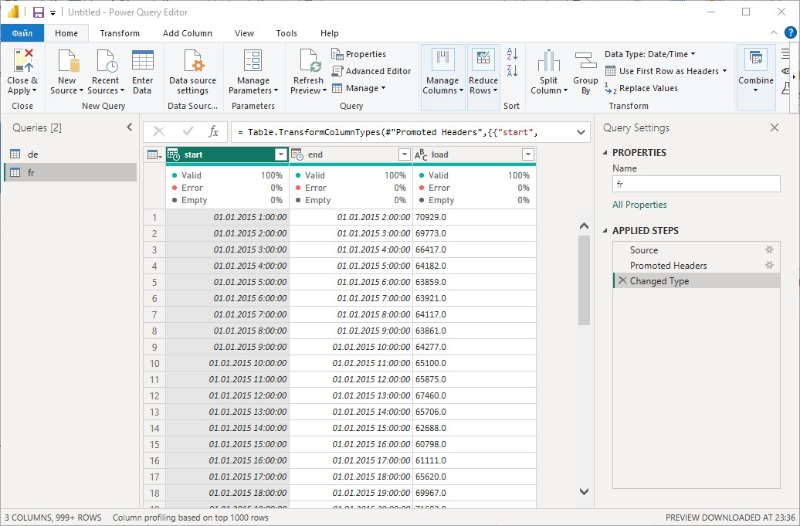
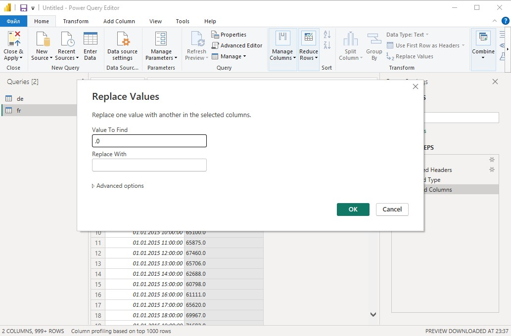
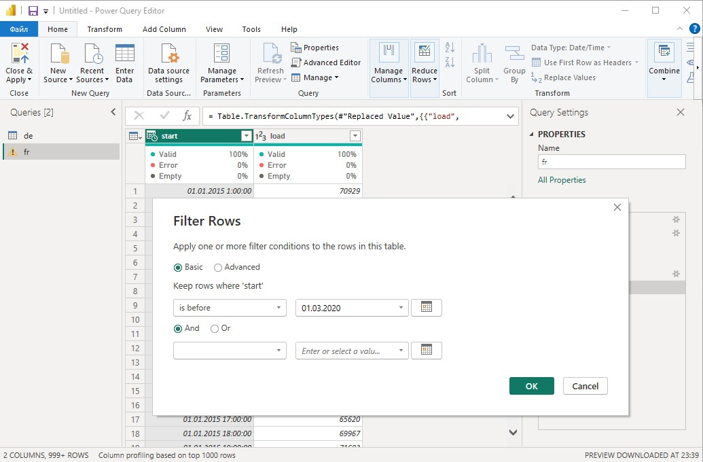
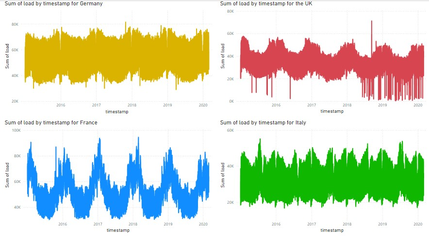

## Introduction

Goal of this project is to enchance my Power BI skills. Dataset for this project is free and available on [Kaggle](https://www.kaggle.com/datasets/francoisraucent/western-europe-power-consumption/data).

## Background

The dataset I used contains information about the power consumption in western Europe form January 2015 up to August 2020 in Megawatts (MW).

Below is an example of the data in this table. There are is information about MW consumed in each 15 minutes (load).

| Nr  | start                     | end                       | load    |
| --- | ------------------------- | ------------------------- | ------- |
| 5   | 2015-01-01 01:15:00+00:00 | 2015-01-01 01:30:00+00:00 | 40312.0 |
| 6   | 2015-01-01 01:30:00+00:00 | 2015-01-01 01:45:00+00:00 | 39984.0 |
| 7   | 2015-01-01 01:45:00+00:00 | 2015-01-01 02:00:00+00:00 | 39626.0 |
| 8   | 2015-01-01 02:00:00+00:00 | 2015-01-01 02:15:00+00:00 | 39472.0 |
| 9   | 2015-01-01 02:15:00+00:00 | 2015-01-01 02:30:00+00:00 | 39217.0 |

## Tools I used

To create a report with visualisations:

- **Power BI** to create a report
- **Bash** for interaction with OS, doing terminal based tasks and working with GitHub
- **Git** for version control

## Data analysis

First data has to be extracted from .csv files and prepared for analyse and visualisation
In this case it could be done in following steps:

1. Load the data from a .csv file using "Get data":
   

2. Remove end column because it is not useful in this case. Work on data types: to be able to use the data it has to be in a proprite format, here it is "Date/Time" for the "timestamp" (renamed "start") and "Whole Number" for "load" column. For the second column it is a bit tricky, because there would be an error when changing the type directly; to fix this problem it is possible to firstly replace ".0" at the end of each value with empty space and then change the type.
   

3. After changing datatypes there is one more important point to consider about: this dataset consists of the values up to August of 2020, but if looking at the data it is clear, that starting on 1st of March there is a significant drop in consumption, the reason for that is COVID-19 pandemics. It would make sence to drop values for this period to have a consistent dataset for analyse. It could be a great idea to use that data to see pandemics impact on the consumption, but it is more data neccesary to be able to do that.
   

4. First visualisation of the power consumption for four countries (Germany, France, UK, Italy) looks as follows:
   
